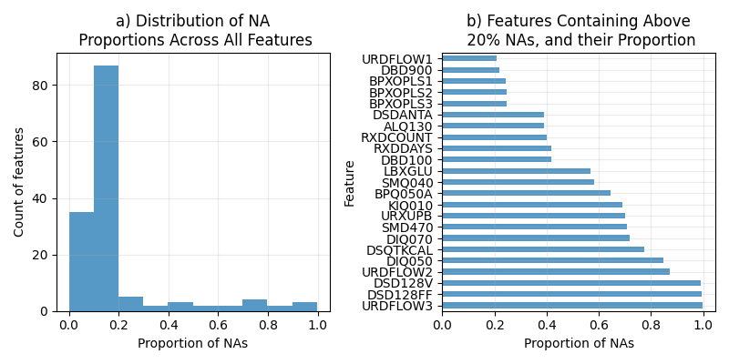
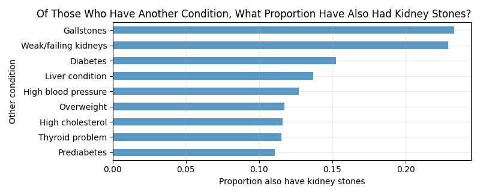

```{r setup, include=FALSE}
knitr::opts_chunk$set(echo = FALSE, message = FALSE, warning = FALSE)
library(knitr)
library(kableExtra)
```

\newpage

# 1. Executive Summary

# 2. Background

Is kidney stone prevalence associated with factors such as diet, lifestyle, and other existing medical conditions? Kidney stones are solid deposits of minerals and salts that develop in the urinary tract, and can cause blockage and severe pain when urine is passed (National Institutes of Health, n.d.). It is a common condition that affects approximately 10% of people at least once in their lifetime, and in some cases may require significant and/or recurrent treatment (Abufaraj et al., 2020). 

This report presents an exploratory data analysis, investigating variables previously shown to be associated with kidney stone occurance.  It is based on the [National Health and Nutrition Examination Survey](https://www.cdc.gov/nchs/nhanes/index.htm) (NHANES) from the [National Center for Health Statistics](https://www.cdc.gov/nchs/index.htm), of the [Centers for Disease Control and Prevention](https://www.cdc.gov/). NHANES is an ongoing program of surveys in the United States that assesses the health and nutritional status of adults and children. The surveys collect health-related data ranging over a number of topics, which are organised broadly into Demographics, Dietary, Examination, Laboratory, and Questionnaire. It is widely used to analyse or identify associative or causal factors of various conditions and/or diseases, such as diabetes, hypertension, and hearing loss. Thus, the comprehensive scope of NHANES makes it an ideal resource to investigate factors associated with kidney stones, especially given the diverse range of known causes.

In the following sections, we evaluate the completeness, quality, and distributions of kidney stone-relevant data in NHANES. The aim is to explore and identify potentially suitable features for developing a machine learning model to predict kidney stone prevalence using the NHANES dataset.

Data from the most recent cycle is used, [NHANES 2017 - March 2020](https://wwwn.cdc.gov/nchs/nhanes/continuousnhanes/default.aspx?Cycle=2017-2020).

# 3. Data Description

## 3.1 Data Structure and Types

```{r}
df <- read.csv("../../data/merged_data_clean.csv")
```

Data from each NHANES cycle is released as many tables, each containing a collection of similar features. For the specific focus on kidney stone disease, only a subset of tables is used, and from these tables, only a subset of key features. The integrated dataset used in this project is composed of `r nrow(df)` instances/rows, and `r ncol(df)` columns. The column `SEQN` contains a unique identifier for each instance, and the column `KIQ026` contains the target variable. Thus, there are `r ncol(df) - 2` informative features. 

The target variable belongs to the Questionnaire component of NHANES, and is phrased as "Ever had kidney stones?". Possible answers of this question are "Yes", "No", "Refused", and "Don't know". Only Yes/No are used as the binary classification label of this project (details are discussed in Section 1.4: Data Integration).

Counts (and proportions) of the binary target variable classes are as follows:

* Yes, has had kidney stones: 866 instances (`r signif((sum(df$KIQ026 == 1)/nrow(df)), 4)`)
* No, has not had kidney stones: 8342 instances (`r signif(sum(df$KIQ026 == 2)/nrow(df), 4)`)

The key features are broadly described in the following:

* Demographic: gender, age, race, education, marital status, and income. Men and older individuals are more likely to have had kidney stones (Lieske et al., 2014), and there is evidence that kidney stone prevalence and severity is associated with various socioeconomic factors (Bayne et al., 2019; Trivedi et al., 2008; Winitzki et al., 2022). 
* Dietary: vitamin, water, nutrient, and dietary supplement intake. Kidney stone incidence increases with certain dietary habits, such as low calcium, low potassium, and low fluid diets (Cappucio et al., 1990; Chewcharat et al., 2022). Everyday foods in the NHANES dietary interviews are deconstructed and aggregated into their nutritional components, thus there is highly specific (and largely correlated) dietary and nutrient data that constitutes a significant portion of the total features explored.
* Examination: body mass index (BMI), blood pressure, and pulse readings. Indicators of general health are useful predictive features for kidney stone risk (Cappucio et al., 1990; Jeong et al., 2011).
* Laboratory: aspects of biochemistry profile, and urine-associated tests. Kidney diseases or urinary tract abnormalities (that can lead to kidney stones) have been associated with abnormal urinary levels of components such as glucose, lead, and albumin creatinine ratio (Spatola et al., 2016). Studies using NHANES, by Chewcharat & Curhan (2020) and Sun et al. (2019), have previously assessed prevalence of kidney stones in comparison to relevant laboratory values.
* Questionnaire: past medical history (conditions and medicines), dietary and alcohol habits, urinary tract function, physical activity, smoking, and sleep habits. Again, general health, behaviours, and lifestyle have a large influence on kidney stone disease (Li et al., 2014; Xue et al., 2024). Factors such as lack of physical activity and smoking can indirectly damage the urinary tract and promote stone formation (Lieske, 2013; Soueidan et al., 2015).

Feature type ranges from numerical continuous and discrete to categorical binary, nominal, and ordinal. Dietary, examination, and laboratory data are mainly numerical, while demographic and questionnaire data are mainly categorical. To avoid difficult or complicated natural languange processing or text mining, free-text data was not selected.

Counts of feature types and brief examples are as follows:

* 97 numerical features, e.g. energy in kilocalories (continuous); age in years (discrete)
* 49 categorical features, e.g. gender (binary: male, female); race (nominal: Mexican American, other Hispanic, white, etc.); diet healthiness (ordinal: excellent, very good, fair, etc.)

## 3.2 Data Completeness

```{r}
na_df <- read.csv("../figures/na_prop.csv")
```

`r sum(na_df$Proportion == 0) - 2` features have no missing values (not including the unique identifier and target variable columns). 

Features that do have missing data can be summarised as follows:

* `r sum((na_df$Proportion > 0) & (na_df$Proportion <= 0.25))` features have under 25% missing data; 
* `r sum((na_df$Proportion > 0.25) & (na_df$Proportion <= 0.50))` features have 25 - 50% missing data; 
* `r sum((na_df$Proportion > 0.5) & (na_df$Proportion <= 0.75))` features have 50 - 75% missing data; 
* `r sum((na_df$Proportion > 0.75) & (na_df$Proportion <= 1))` features have 75% - 100% missing data.

```{r}

```

Figure 1: a) Count of features with various missing data proportions. b) Missing data proportions of the features containing above 20% missing data. `URDFLOW1`: urine #1 flow rate; `DBD900`: # meals from fast food/pizza place; `BPXOPLS1`: pulse, 1st osocillometric reading; `BPXOPLS2`: pulse, 2nd oscillometric reading; `BPXOPLS3`: pulse, 3rd oscillometric reading; `DSDANTA`: taking antacid; `ALQ130`: average # alcoholic drinks/day; `RDXCOUNT`: # precription medicines taken; `RXDDAYS`: # days taken medicine; `DBD100`: how often add salt to food at table; `LBXGLU`: fasting glucose; `SMQ040`: smoke cigarettes; `BPQ050A`: taking prescribed medicine for HBP; `KIQ010`: how much urine lose [during urinary leakage]; `URXUPB`: lead, urine; `SMD470`: # people who smoke inside home; `DIQ070`: take diabetic pills; `DSQTKCAL`: energy (kcal);  `DIQ050`: taking insulin; `URDFLOW2`: urine #2 flow rate; `DSD128V`: [take supplement] for kidney, bladder; `DSD128FF`: [take supplement] for liver health, detoxification; `URDFLOW3`: urine #3 flow rate.

Overall, the majority of features do not contain a substantial proportion of missing data (Figure 1a). Features with very large proportions of missing data should be discarded as they are likely to be uninformative.

Over half of features have less than 20% missing data (Figure 1a). Features from the table "Dietary Interview - Total Nutrient Intakes" ([P_DR1TOT](https://wwwn.cdc.gov/Nchs/Nhanes/2017-2018/P_DR1TOT.htm)) are the main contributors to this particular proportion. A large number of features were selected from that table, and data collected within pertains to a consistent subset of people. Consequently, it is reasonable to assume that features originating from the same or similar NHANES tables will share comparable patterns of missing data. For example, features related to dietary intake will only have recorded values for those who partook in dietary interviews, which may differ from the set of people who partook in laboratory tests. This pattern can also be seen in Figure 1b with the set of features `BPXOPLS1`, `BPXOPLS2`, and `BPXOPLS3`, which correspond to successive pulse readings and have identical missing value proportions (~25%).

`KIQ010`, `DSD128V`, and `DSD128FF` are features with very high percentages of missing data (over 50%), as seen in Figure 1b. They have structural missingness - e.g. in the case of `KIQ010`, recording a value for the amount of urine lost is dependent on the participant affirming that they have had urinary leakage, which most participants have not. Likewise, `DSD128V` and `DSD128FF` are both dependent on the participant affiriming that they do take supplements, which, again, may not be the case for most.

It is important to consider missing data when combining or transforming features. Creating another feature that is an average of all three pulse readings (`BPXOPLS1, BPXOPLS2, BPXOPLS3`) will not result in loss of instances, as the features have equivalent proportions of missing data (assumed to belong to the same instances). However, creating a feature that is the average of urine flow rates (`URDFLOW1, URDFLOW2, URDFLOW3`) will result in loss of instances, as all have different proportions of missing data; `URDFLOW3` has nearly 100% missing data, `URDFLOW2` has close to 90%, and `URDFLOW1` has approximately 20%. It is wiser to simply preserve the feature with the least missing data (`URDFLOW1`), instead of attempting feature combination.

## 3.3 Data Integration

Individual tables were obtained from the [NHANES](https://www.cdc.gov/nchs/nhanes/index.htm) site and joined along the unique respondent sequence number variable, `SEQN`, regardless of unmatched `SEQN`s or missing values in features (full outer join). For any subsequent duplicate instances (determined by duplicate `SEQN`), the first instance was taken.

All instances with missing values, recorded "Refused", or "Don't know" for the target variable were then removed from the data.

# 4. Ethics, Privacy, and Security

## 4.1 Ethical Considerations

“...ethical issues can be (a) epistemic, related to misguided, inconclusive or inscrutable evidence; (b) normative, related to unfair outcomes and transformative effectives; or (c) related to traceability” (Morley et al., 2020) 

These are the broad scopes of the ethical issues that are present when using machine learning methods in healthcare.  

* Epistemic – evidence related ethical issues. This includes bias within a dataset, opacity in decision making, and inaccurate decisions made from inconclusive evidence. 

* Normative – learning and transforming processes of algorithms which may result in discriminatory outcomes and/or outcomes where the reasoning is unclear and therefore difficult for a patient to understand, or refute. 

* Traceability – the ability to trace mistakes, and identify responsibility for mistakes. Additionally, that information about the algorithm be accessible and comprehensible (Mittelstadt et al., 2016) 

These ideas are heavily intertwined, for example, bias in a dataset (epistemic) may result in a discriminatory outcome (normative). While we always want our algorithms to have accurate, unbiased outcomes, the stakes become high with healthcare, as an incorrect result could be fatal to the patient. In the context of kidney stone prediction, it is less a diagnostic tool for current kidney stones, but whether they may develop them in future, so preventative measures could be taken to decrease a person’s risk, such as a change in diet, medication or regularity of checkups. While there are not life stakes, there is also the stake of the cost to the patient, and their ability to give informed consent about the medical treatments they recieve – which is difficult to provide if you do not know why you have been deemed at risk. Steps should be taken to make sure the algorithm is traceable, and attempts should be made to reduce any bias prevalent in the dataset. 

## 4.2 Privacy Concerns

Personal health data is extremely sensitive information, making privacy a huge concern. This is a widely recognised concern however, which means there is a great deal of legislation we and NHANES need to be in line with. 

As our data is from the NHANES dataset, which is part of a program by a governmental agency of the United Stated of America, and the data is about those who reside in the United States, we must consider the laws, protections, and regulations the USA has, as well as the laws of our own country and the laws of social acceptance. While we may not be the ones who collected the data or released it, we are not relinquished of our moral duties. Using data that doesn’t meet privacy standards could lead to legal trouble and societal backlash, so ensuring our data already meets privacy standards - and if not, taking steps to ensure it does - is key.  

The United States of America currently has 4 federal laws that cover patient privacy in regards to the NHANES survey data – these are: 

1. The Privacy Act of 1974 - requires that data about an individual cannot be released without the individual’s consent (U.S Department of Justice, 2014).
1. The Confidential Information Protection and Statistical Efficiency Act – states if information is gathered for statistical purposes, it should only be used for statistical purposes, that an individual should not identifiable, and that confidentiality should be safeguarded by controlling access to the information (Federal Chief Information Officers, 2002).
1. The Cybersecurity Enhancement Act – requires agencies to have appropriate cybersecurity measures and plans in place (Library of Congress, 2014).
1. Section 308(d) of the Public Health Service Act – similar to The Confidential Information Protection and Statistical Efficiency Act, it states that a person should not be identifiable, and that the data may only be used for the purpose it was supplied for (National Center for Health Statistics, 2021; Office of the Legislative Council, 2020).

NHANES is currently in compliance with the above acts, and by using the data for statistical purposes, we are in compliance with The Confidential Information Protection and Statistical Efficiency Act. However, the United States of America also has differing data privacy laws state-by-state (Pittman, 2023), and as the NHANES survey is national, participants will be from a variety of states and therefore have different privacy standards. These state level data privacy laws are typically surrounding consumer data and corporations, as opposed to governmental survey data, but are still important to consider. While geographic information is collected as part of NHANES, its use is limited and restricted, so we are unable to verify ourselves if NHANES is complying with the state laws, and the NHANES privacy page and brochure were both released prior to state privacy laws coming into effect. States are also continuing to roll out new privacy laws and not all are yet in effect, and so even if the data is currently legally sound in terms of privacy, this may change in the coming years. While we may not know NHANES and our own exact legality stance in the states currently, we do know that the information that NHANES releases to the public has no identifiable information, only those with special permissions can access some identifiers (such as geographic location), and these steps ensure patient confidentiality. 

## 4.3 Security Measures

To ensure the security of the NHANES dataset and compliance with the National Center for Health Statistics (NCHS) requirements, our project has implemented a set of data security measures. The NHANES dataset is stored in an access-controlled repository, with raw and processed data kept in separate, restricted directories. Access to these directories is limited to authorized group members only, utilizing robust permission settings to control access based on specific tasks and responsibilities.

All data transfers are conducted using secure, encrypted protocols. We maintain detailed audit trails and leverage version control capabilities to track all data access and modifications. Access permissions are regularly reviewed and updated to align with group members' current tasks and responsibilities, ensuring that access rights remain current and appropriate throughout the project lifecycle.

We have implemented a data minimization strategy, ensuring that only essential NHANES data relevant to the project is stored and processed. Additional security measures include two-factor authentication for all team members accessing the data and encryption for any locally stored data.

Upon completion of the project, all data files and any derived data will be securely deleted from all storage locations using methods that prevent recovery. This ensures that the data is not retained unnecessarily and reduces the risk of unauthorized access or disclosure after the project's conclusion.
All these practices are in full compliance with NCHS requirements for handling NHANES data.

# 5. Exploratory Data Analysis

## 5.1 Demographic Analysis

```{r}
knitr::include_graphics("../figures/demo_ks_prev.png")
```

Figure 2: a) Density distribution of age across those who have had kidney stones and those who have not. b) Proportion of males and females within their respective groups who have had kidney stones. c) Proportion of various races within their respective groups who have had kidney stones. d) Proportion of various education levels within their respective groups who have had kidney stones. The category "Refused" was removed due to low count. e) Proportion of various marital statuses within their respective groups who have had kidney stones. The categories "Refused" and "Don't Know" were removed due to low count. f) Density distribution of ratio of family income to poverty guidelines.

At a younger age (20 - 40 years of age), a notably higher proportion of people have never had kidney stones as opposed to have (Figure 2a). As age increases (> 50 years of age), the proportion of people who have never had kidney stones becomes less than those who have. The overall prevalence of having had kidney stones increases steadily from 20 - 40 years of age, plateaus after 40 years of age, then increases again to peak at ~60 years of age.

Figure 2b shows that approximately 10% of males have had kidney stones, while a lesser percentage of around 8% of females have. Thus, kidney stones among males are slightly higher than the overall prevalence of kidney stones (~9.4%), while females are slightly below.

There is clear fluctuation in kidney stone prevalence among different races (Figure 2c), with Asian and Black people at the lowest (just above 5% have had kidney stones), increasing to Mexican Americans (approximately 8%). Races with kidney stone prevalence greater than the overall prevalence are other Hispanic (over 10%), other/multiracial, and White people (latter two are close to 15%). There is a large distinction (~10%) between the lowest and highest prevalence. The low and high proportions are also significantly different from the overall kidney stone prevalence.

As education level changes, the proportion of those who have had kidney stones fluctuates, but there is no obvious trend among successive education levels (Figure 2d). The difference between the education level with the highest kidney stone prevalence (college/AA degree at ~10%) and lowest (high school grad/GED at ~8%) is relatively minimal.

Those that are married/living with partner or widowed/divorced/separated show a greater prevalence of kidney stones than those that have never married, as seen in Figure 2e. Never married people also have a much lower prevalence than overall kidney stone prevalance. However, this may be due to the confounding factor of age, instead of an inherent characteristic of marriage that increases kidney stone occurance.

In Figure 2f, a ratio close to 1 means family income is approximately equal to poverty thresholds; greater than 1 means family income is above poverty thresholds. At a lower to middle ratio (0 - 4), it is slightly more common to not have had kidney stones, but not significantly. At a higher ratio (> 4), there is a large difference - the prevalence of never having had kidney stones is notably higher than having had them. 

Overall, Figure 2 indicates that nearly all demographic features - age, gender, marital status, race, and ratio of family income to poverty guidelines - are associated with prevalence of kidney stones. Confirming previous research, older people and males are more likely to have had kidney stones. Age may be a confounding factor in the apparent association of kidney stone occurance with marital status, but regardless it can still be a useful feature. The lack of significant association between education level and kidney stones indicate that it might be uninformative in a predictive context.

## 5.2 Health Conditions Analysis

```{r}

```

Figure 3: The proportion of people with various other conditions who also have had kidney stones.

Gallstones and weak/failing kidneys are the most strongly associated with kidney stone occurance, with close to 25% of people having (either or both of) those conditions also having had kidney stones. Between ~11% and ~15% of people who have the remaining conditions also have had kidney stones. All these are much higher than overall kidney stone prevalence (9.4%), indicating that these features are likely to be useful for a predictive model. It can be noted that some of these conditions may also possess a high degree of correlation between each other, which may be reflected in their similar proportions in Figure 3, e.g. being overweight and having high cholesterol. Feature combination/transformation could be used to reduce dimensionality.

## 5.3 Laboratory Analysis

```{r}
knitr::include_graphics("../figures/lab_dist.png")
knitr::include_graphics("../figures/corrlab.png")
```

Figure 4: Density distributions of laboratory features, split by those who have had kidney stones and have not had kidney stones. a) Fasting glucose. b) Blood urea nitrogen. c) Total calcium. d) Uric acid. e) Albumin creatinine ratio. f) Lead in urine. g) Shows the Pearson Correlation values between the laboratory results, not discriminant of kidney stone status.

Figure 4 shows that most laboratory features appear within expected ranges, with the exception of uric acid (Figure 4d). There appears to be outlier(s) skewing this feature with up to 10000 mg/dL uric acid, which is likely to be an error as ordinary uric acid levels should not exceed the single-digit mg/dL range. 

Distribution shape of laboratory features remains relatively identical, regardless of kidney stone status. Distributions for fasting glucose (Figure 4a) and total calcium (Figure 4c) are shifted slightly right (towards higher values) for those who have had kidney stones. The peak bin for blood urea nitrogen (Figure 4b) is at a marginally lower value for those who have had kidney stones in comparison to those who have not. Albumin creatinine ratio appears to peak later, and remain slightly higher, at increasing mg/g for those who have had kidney stones (Figure 4e). Distributions for lead (Figure 4f) and uric acid are consistent for both kidney stone statuses - however, detail in the uric acid histogram may be obscured by the outlier(s). 

Therefore this indicates that uric acid and lead are not associated with kidney stone prevalence. The remaining laboratory features are associated due to differing distributions according to kidney stone status.

When looking at the correlation between the laboratory features (Figure 4g) we can see many close to 0 Pearson correoratory features are not strongly correlated. Because of this, it would be unreasonable to exclude any of these features based off of these values alone. The largest Pearson values here are seen with fasting glucose, but even this does not exceed 0.31, and a value of at least 0.7, or close to, would be needed to state a strong relationship. A compounding of other factors (correlation with other predictors, relationship to our kidney stones response variable, number of total features) would be needed to justify removing any of these predictors based off of their Pearson correlation values.

## 5.4 Dietary Analysis

```{r}
knitr::include_graphics("../figures/dietary_difference.png")
```

Figure 5: Dietary Differences

Alcohol consumption shows the largest difference, with individuals who have had kidney stones consuming 25.2% less alcohol. This aligns with studies suggesting that excessive alcohol intake can increase kidney stone risk by causing dehydration and altering urine composition (Ferraro et al., 2013).

In addition, alpha-carotene and beta-carotene (both forms of vitamin A) display substantial negative differences (-24.0% and -13.8% respectively), with those who have had kidney stones consuming less. This unexpected finding warrants further investigation, as some studies have suggested that higher intake of fruits and vegetables rich in carotenoids may be associated with lower risk of kidney stones (Sorensen et al., 2014).

Interestingly, other form of vitamin A, Retinol intake is 11.5% higher in the kidney stone group, contrasting with the carotenoid findings. This discrepancy highlights the complex relationship between different forms of vitamin A and kidney stone risk. Some research has indicated that excessive vitamin A intake may increase kidney stone risk (Tang et al., 2012), which could explain the lower carotenoid but higher retinol intake in those with a history of stones.

Caffeine and theobromine consumption is notably higher in those with a history of kidney stones (14.4% and 13.9% more, respectively). While caffeine has been associated with increased risk of kidney stones in some studies (Ferraro et al., 2014), the higher intake in those with a history of stones could reflect changes in fluid consumption patterns post-diagnosis.

Lycopene intake is 10.1% higher in those with a history of kidney stones. Some research suggests that lycopene may have protective effects against kidney stone formation due to its antioxidant properties (Yencilek et al., 2010), making this finding particularly interesting.

Vitamin C intake is 8.4% lower in individuals who have had kidney stones. This aligns with studies suggesting that high-dose vitamin C supplementation may increase kidney stone risk (Thomas et al., 2013), potentially leading to reduced intake in those with a history of stones.

Among the top factors, we see a trend in vitamins and antioxidants, particularly forms of vitamin A, vitamin C, and vitamin E (alpha-tocopherol). This pattern suggests that the balance and forms of certain vitamins may be different in individuals with a history of kidney stones.

## 5.5 Physical Activity Analysis

```{r}
knitr::include_graphics("../figures/combined_kidney_stones_graphs.png")
```

Figure 6: Association between Kidney Stone History and a) Sedentary Behavior, and b) Physical Activity Patterns

Figure 6a shows a density plot of minutes spent sitting per day for the two groups. The distributions for both groups appear very similar, with peaks around 500-1000 minutes (approximately 8-16 hours) of sitting time per day. There's a slight indication that those without kidney stones might have a marginally higher peak, but the difference is minimal. This suggests that sitting time may not be a significant differentiating factor between the two groups.

There is small secondary peak at around 10,000 minutes (~167 hours) of sitting time and negative minutes spent sitting in both groups likely represents outliers or data entry errors.

Examining physical activity patterns in Figure 6b, we observe slight differences in recreational activities between those with and without kidney stone history. For moderate-intensity sports, fitness, or recreational activities (38.5% vs. 40.4%), vigorous-intensity activities (21.0% vs. 24.0%), and walking or cycling for at least 10 minutes continuously (19.6% vs. 22.9%), individuals without kidney stone history report marginally higher participation rates. While these differences are small, they align with findings from Sorensen et al. (2014), who reported that higher levels of physical activity were associated with lower risk of kidney stones. This association might be explained by the positive effects of exercise on metabolism, body composition, and hydration status (Qin et al., 2018). 

Interestingly, for work-related physical activities, we see a reverse trend. Those with kidney stone history report slightly higher rates of work-related moderate-intensity activity (44.7% vs. 43.0%) and work-related vigorous-intensity activity (27.8% vs. 24.7%). This distinction between recreational and occupational physical activity in relation to kidney stone history is intriguing and warrants further investigation. Overall, the differences in participation rates are generally small (1-3 percentage points) except for vigorous work activities and walking/cycling, where the gaps are slightly larger.

It may suggest that the context and nature of physical activity, not just the intensity, could play a role in kidney stone risk. Occupational physical activity might have different physiological effects compared to recreational exercise, possibly due to differences in hydration patterns, stress levels, or other workplace factors (Coenen et al., 2018).

The complex relationship between physical activity and kidney stone risk underscores the need for more nuanced research in this area. Future studies should consider not only the quantity but also the quality and context of physical activity, as well as potential confounding risk factors.

## 5.6 Risk Factor Analysis
```{r}
knitr::include_graphics("../figures/Risk_Factor_Analysis_small.png")
```
Figure 8: a) Kidney stone prevalence and smoking at least 100 cigarettes in life. Categories "Refused" and "Don't Know" were removed due to low count. b) Kidney stone prevalence and the number of prescriptions taken. c) Kidney stone prevalence and trouble sleeping. Categories "Refused" and "Don't Know" were removed due to low count.

In Figure 8a, the proportion of people who have kidney stones or not, for people with some certain characteristics (smoke more then 1000 time in their life, smoke less then 1000 time in their life, don’t know and refuse to answer) can be seen. The prevalence of kidney stones for people who have smoked at least 100 cigarettes in their life is higher then who have not. From this, it shows the correlation between risk of kidney stone and smoking, and backs up research showing correlation between smoking and risk of kidney stones (Chen et al., 2023). It means that smoking will increase the risk of developing kidney stones.

Figure 8b shows the average the number of prescriptions taken by those who have had kidney stones, and those who have not. We can see that people who have kidney stones tend to have a higher number of prescriptions taken, compared to people who have never had kidney stones. From this, it shows the correlation between risk of kidney stones and number of prescriptions taken, and backs up research indicating causation between kidney stone occurance and number of prescriptions taken (NHS, 2018). Some prescriptions increase the risk of developing kidney stones; as the number of prescriptions taken increases, it is more likely for that person to have kidney stones (since, according to University of Florida Health (2019), kidney stones are related to many medical conditions).

In Figure 8c, the proportion of people who have kidney stones and those who do not are shown against people who have a sleeping issue and do not have a sleeping issue. The proportion of kidney stones for people who answer yes (have sleeping issue) is higher than those who answer no (no sleeping issue). From this, it backs up research linking risk of kidney stones to sleeping issues (University of Florida Health, 2019). 


\newpage

# 6. References

&nbsp;&nbsp;&nbsp;&nbsp;Abufaraj, M., Xu, T., Cao, C., Waldhoer, T., Seitz, C., D’andrea, D., Siyam, A., Tarawneh, R., Fajkovic, H., Schernhammer, E., Yang, L., & Shariat, S. F. (2020). Prevalence and Trends in Kidney Stone Among Adults in the USA: Analyses of National Health and Nutrition Examination Survey 2007–2018 Data. European Urology Focus, 7(6). https://doi.org/10.1016/j.euf.2020.08.011

&nbsp;&nbsp;&nbsp;&nbsp;Bayne, D. B., Usawachintachit, M., Armas-Phan, M., Tzou, D. T., Wiener, S., Brown, T. T., Stoller, M., & Chi, T. L. (2019). Influence of Socioeconomic Factors on Stone Burden at Presentation to Tertiary Referral Center: Data From the Registry for Stones of the Kidney and Ureter. Urology, 131, 57–63. https://doi.org/10.1016/j.urology.2019.05.009

&nbsp;&nbsp;&nbsp;&nbsp;Cappuccio, F. P., Strazzullo, P., & Mancini, M. (1990). Kidney stones and hypertension: population based study of an independent clinical association. BMJ, 300(6734), 1234–1236. https://doi.org/10.1136/bmj.300.6734.1234

&nbsp;&nbsp;&nbsp;&nbsp;Chen, Y., Lee, J., Shen, J.-T., Wu, Y., Tsao, Y.-H., Jhan, J., Wang, H.-S., Lee, Y., Huang, S.-P., Chen, S.-C., & Geng, J.-H. (2023). The impact of secondhand smoke on the development of kidney stone disease is not inferior to that of smoking: a longitudinal cohort study. BMC Public Health, 23(1). https://doi.org/10.1186/s12889-023-16116-6

&nbsp;&nbsp;&nbsp;&nbsp;Chewcharat, A., & Curhan, G. (2020). Trends in the prevalence of kidney stones in the United States from 2007 to 2016. Urolithiasis, 49, 27–39. https://doi.org/10.1007/s00240-020-01210-w

&nbsp;&nbsp;&nbsp;&nbsp;Chewcharat, A., Thongprayoon, C., Vaughan, L. E., Mehta, R. A., Schulte, P. J., O’Connor, H. M., Lieske, J. C., Taylor, E. N., & Rule, A. D. (2022). Dietary Risk Factors for Incident and Recurrent Symptomatic Kidney Stones. Mayo Clinic Proceedings, 97(8), 1437–1448. https://doi.org/10.1016/j.mayocp.2022.04.016

&nbsp;&nbsp;&nbsp;&nbsp;Coenen, P., Huysmans, M. A., Holtermann, A., Krause, N., van Mechelen, W., Straker, L. M., & van der Beek, A. J. (2018). Do highly physically active workers die early? A systematic review with meta-analysis of data from 193 696 participants. British Journal of Sports Medicine, 52(20), 1320–1326. https://doi.org/10.1136/bjsports-2017-098540

&nbsp;&nbsp;&nbsp;&nbsp;Curhan, G. C. (2007). Epidemiology of Stone Disease. Urologic Clinics of North America, 34(3), 287–293. https://doi.org/10.1016/j.ucl.2007.04.003

&nbsp;&nbsp;&nbsp;&nbsp;Federal Chief Information Officers. (2002). Confidential Information Protection and Statistical Efficiency Act. Federal Chief Information Officers; U.S. Federal Government. https://www.cio.gov/handbook/it-laws/cipsea/

&nbsp;&nbsp;&nbsp;&nbsp;Ferraro, P. M., Curhan, G. C., Sorensen, M. D., Gambaro, G., & Taylor, E. N. (2015). Physical Activity, Energy Intake and the Risk of Incident Kidney Stones. Journal of Urology, 193(3), 864–868. https://doi.org/10.1016/j.juro.2014.09.010

&nbsp;&nbsp;&nbsp;&nbsp;Ferraro, P. M., Taylor, E. N., Gambaro, G., & Curhan, G. C. (2013). Soda and Other Beverages and the Risk of Kidney Stones. Clinical Journal of the American Society of Nephrology, 8(8), 1389–1395. https://doi.org/10.2215/cjn.11661112

&nbsp;&nbsp;&nbsp;&nbsp;Ferraro, P. M., Taylor, E. N., Gambaro, G., & Curhan, G. C. (2014). Caffeine intake and the risk of kidney stones. The American Journal of Clinical Nutrition, 100(6), 1596–1603. https://doi.org/10.3945/ajcn.114.089987

&nbsp;&nbsp;&nbsp;&nbsp;Hellerstein, J. (2008). Quantitative Data Cleaning for Large Databases. https://dsf.berkeley.edu/jmh/papers/cleaning-unece.pdf

&nbsp;&nbsp;&nbsp;&nbsp;Jeong, I. G., Kang, T., Bang, J. K., Park, J., Kim, W., Hwang, S. S., Kim, H. K., & Park, H. K. (2011). Association Between Metabolic Syndrome and the Presence of Kidney Stones in a Screened Population. American Journal of Kidney Diseases, 58(3), 383–388. https://doi.org/10.1053/j.ajkd.2011.03.021

&nbsp;&nbsp;&nbsp;&nbsp;Li, C. - H., Sung, F. - C., Wang, Y. - C., Lin, D., & Kao, C. - H. (2014). Gallstones increase the risk of developing renal stones: a nationwide population-based retrospective cohort study. QJM: An International Journal of Medicine, 107(6), 451–457. https://doi.org/10.1093/qjmed/hcu017

&nbsp;&nbsp;&nbsp;&nbsp;Library of Congress. (2014, December 18). S.1353 - 113th Congress (2013-2014): Cybersecurity Enhancement Act of 2014. Library of Congress. https://www.congress.gov/bill/113th-congress/senate-bill/1353

&nbsp;&nbsp;&nbsp;&nbsp;Lieske, J. C. (2013). New Insights Regarding the Interrelationship of Obesity, Diet, Physical Activity, and Kidney Stones. Journal of the American Society of Nephrology, 25(2), 211–212. https://doi.org/10.1681/asn.2013111189

&nbsp;&nbsp;&nbsp;&nbsp;Lieske, J. C., Rule, A. D., Krambeck, A. E., Williams, J. C., Bergstralh, E. J., Mehta, R. A., & Moyer, T. P. (2014). Stone composition as a function of age and sex. Clinical Journal of the American Society of Nephrology: CJASN, 9(12), 2141–2146. https://doi.org/10.2215/CJN.05660614

&nbsp;&nbsp;&nbsp;&nbsp;Mittelstadt, B. D., Allo, P., Taddeo, M., Wachter, S., & Floridi, L. (2016). The Ethics of algorithms: Mapping the Debate. Big Data & Society, 3(2), 1–21.Morley, J., Machado, C. C. V., Burr, C., Cowls, J., Joshi, I., Taddeo, M., & Floridi, L. (2020). The ethics of AI in health care: A mapping review. Social Science & Medicine, 260(113172). https://doi.org/10.1016/j.socscimed.2020.113172

&nbsp;&nbsp;&nbsp;&nbsp;National Center for Health Statistics. (2013). Vital and Health Statistics Report Series 1, Number 56 August 2013. National Center for Health Statistics. https://www.cdc.gov/nchs/data/series/sr_01/sr01_056.pdf

&nbsp;&nbsp;&nbsp;&nbsp;National Center for Health Statistics. (2021, July 22). NHANES - Your Privacy Matters. National Center for Health Statistics; Centers for Disease Control and Prevention. https://www.cdc.gov/nchs/nhanes/participant/participant-confidentiality.htm

&nbsp;&nbsp;&nbsp;&nbsp;National Institutes of Health. (n.d.). Kidney Stones. National Institute of Diabetes and Digestive and Kidney Diseases. https://www.niddk.nih.gov/health-information/urologic-diseases/kidney-stones?dkrd=hispt0421

&nbsp;&nbsp;&nbsp;&nbsp;NHS. (2018, October 3). Kidney stones - Causes. NHS. https://www.nhs.uk/conditions/kidney-stones/causes/

&nbsp;&nbsp;&nbsp;&nbsp;Office of the Legislative Counsel. (2020). Public Health Service Act. Office of the Legislative Counsel. https://www.govinfo.gov/content/pkg/COMPS-8773/pdf/COMPS-8773.pdf

&nbsp;&nbsp;&nbsp;&nbsp;Prezioso, D., Strazzullo, P., Lotti, T., Bianchi, G., Borghi, L., Caione, P., Carini, M., Caudarella, R., Gambaro, G., Gelosa, M., Guttilla, A., Illiano, E., Martino, M., Meschi, T., Messa, P., Miano, R., Napodano, G., Nouvenne, A., Rendina, D., & Rocco, F. (2015). Dietary treatment of urinary risk factors for renal stone formation. A review of CLU Working Group. Archivio Italiano Di Urologia E Andrologia, 87(2), 105. https://doi.org/10.4081/aiua.2015.2.105

&nbsp;&nbsp;&nbsp;&nbsp;Sorensen, M. D., Chi, T., Shara, N. M., Wang, H., Hsi, R. S., Orchard, T., Kahn, A. J., Jackson, R. D., Miller, J., Reiner, A. P., & Stoller, M. L. (2014). Activity, energy intake, obesity, and the risk of incident kidney stones in postmenopausal women: a report from the Women’s Health Initiative. Journal of the American Society of Nephrology: JASN, 25(2), 362–369. https://doi.org/10.1681/ASN.2013050548

&nbsp;&nbsp;&nbsp;&nbsp;Sorensen, M. D., Hsi, R. S., Chi, T., Shara, N., Wactawski-Wende, J., Kahn, A. J., Wang, H., Hou, L., & Stoller, M. L. (2014). Dietary Intake of Fiber, Fruit and Vegetables Decreases the Risk of Incident Kidney Stones in Women: A Women’s Health Initiative Report. Journal of Urology, 192(6), 1694–1699. https://doi.org/10.1016/j.juro.2014.05.086

&nbsp;&nbsp;&nbsp;&nbsp;Soueidan, M., Bartlett, S. J., Noureldin, Y. A., Andersen, R. E., & Andonian, S. (2015). Leisure time physical activity, smoking and risk of recent symptomatic urolithiasis: Survey of stone clinic patients. Canadian Urological Association Journal, 9(7-8), 257. https://doi.org/10.5489/cuaj.2879

&nbsp;&nbsp;&nbsp;&nbsp;Spatola, L., Angelini, C., Badalamenti, S., Maringhini, S., & Gambaro, G. (2016). Kidney stones diseases and glycaemic statuses: focus on the latest clinical evidences. Urolithiasis, 45(5), 457–460. https://doi.org/10.1007/s00240-016-0956-8

&nbsp;&nbsp;&nbsp;&nbsp;Sun, Y., Zhou, Q., & Zheng, J. (2019). Nephrotoxic metals of cadmium, lead, mercury and arsenic and the odds of kidney stones in adults: An exposure-response analysis of NHANES 2007–2016. Environment International, 132, 105115. https://doi.org/10.1016/j.envint.2019.105115

&nbsp;&nbsp;&nbsp;&nbsp;Tang, J., McFann, K. K., & Chonchol, M. B. (2012). Association between serum 25-hydroxyvitamin D and nephrolithiasis: the National Health and Nutrition Examination Survey III, 1988-94. Nephrology Dialysis Transplantation, 27(12), 4385–4389. https://doi.org/10.1093/ndt/gfs297

&nbsp;&nbsp;&nbsp;&nbsp;Thomas, L. D. K., Elinder, C.-G., Tiselius, H.-G., Wolk, A., & Åkesson, A. (2013). Ascorbic Acid Supplements and Kidney Stone Incidence Among Men: A Prospective Study. JAMA Internal Medicine, 173(5), 386. https://doi.org/10.1001/jamainternmed.2013.2296

&nbsp;&nbsp;&nbsp;&nbsp;Trivedi, R. B., Ayotte, B., Edelman, D., & Bosworth, H. B. (2008). The association of emotional well-being and marital status with treatment adherence among patients with hypertension. Journal of Behavioral Medicine, 31(6), 489–497. https://doi.org/10.1007/s10865-008-9173-4

&nbsp;&nbsp;&nbsp;&nbsp;U.S. Department of Justice. (2014, June 16). Office of Privacy and Civil Liberties | Privacy Act of 1974. Office of Privacy and Civil Liberties; U.S Department of Justice. https://www.justice.gov/opcl/privacy-act-1974#:~:text=The%20Privacy%20Act%20prohibits%20the

&nbsp;&nbsp;&nbsp;&nbsp;University of Florida Health. (2019). Kidney stones. Department of Urology; University of Florida Health. https://ufhealth.org/conditions-and-treatments/kidney-stones

&nbsp;&nbsp;&nbsp;&nbsp;Wang, X., Sun, M., Wang, L., Li, J., Xie, Z., Guo, R., Wang, Y., & Li, B. (2023). The role of dietary inflammatory index and physical activity in depressive symptoms: Results from NHANES 2007–2016. Journal of Affective Disorders, 335, 332–339. https://doi.org/10.1016/j.jad.2023.05.012

&nbsp;&nbsp;&nbsp;&nbsp;Winitzki, D., Zacharias, H. U., Nadal, J., Baid-Agrawal, S., Schaeffner, E., Schmid, M., Busch, M., Bergmann, M. M., Schultheiss, U., Kotsis, F., Stockmann, H., Meiselbach, H., Wolf, G., Krane, V., Sommerer, C., Eckardt, K.-U., Schneider, M. P., Schlieper, G., Floege, J., & Saritas, T. (2022). Educational Attainment Is Associated With Kidney and Cardiovascular Outcomes in the German CKD (GCKD) Cohort. Kidney International Reports, 7(5). https://doi.org/10.1016/j.ekir.2022.02.001

&nbsp;&nbsp;&nbsp;&nbsp;Xue, W., Xue, Z., Liu, Y., Yin, P., Liu, L., Qu, S., Wu, S., & Yang, C. (2024). Is Kidney Stone Associated with Thyroid Disease? The United States National Health and Nutrition Examination Survey 2007–2018. Endocrine, Metabolic & Immune Disorders, 24(11). https://doi.org/10.2174/0118715303268738231129093935

&nbsp;&nbsp;&nbsp;&nbsp;Yencilek, E., Yencilek, F., Ozcan, C., Demirel, A., Coskun, S., & Basaran, M. (2010). The effect of lycopene on the kidney stones: a preliminary study. Urological Research, 38(4). 