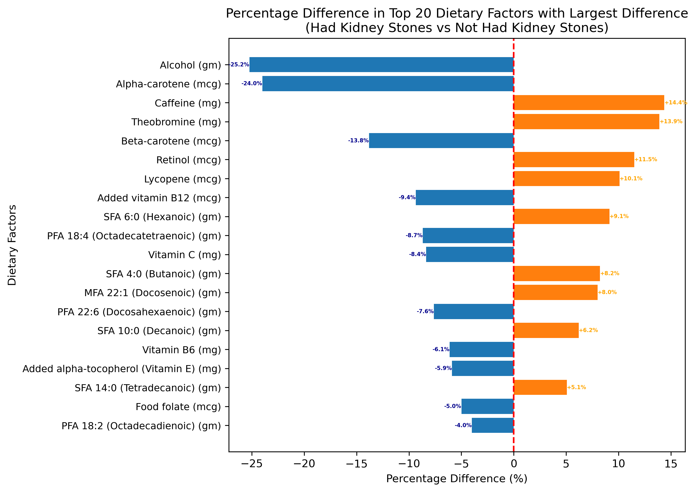
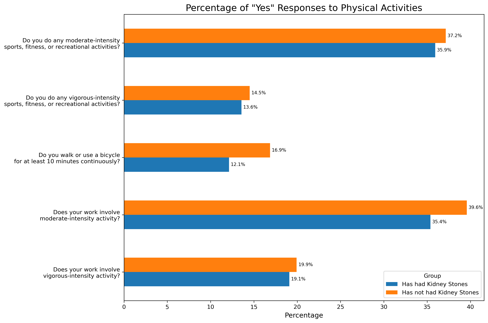

```{r setup, include=FALSE}
knitr::opts_chunk$set(echo = FALSE, message = FALSE, warning = FALSE)
# Load required libraries here
# library(tidyverse)
library(knitr)
library(kableExtra)
```

\newpage

# Background and Data

## Dataset

This project is based on the [National Health and Nutrition Examination Survey](https://www.cdc.gov/nchs/nhanes/index.htm) (NHANES) from the [National Center for Health Statistics](https://www.cdc.gov/nchs/index.htm), of the [Centers for Disease Control and Prevention](https://www.cdc.gov/). Data from the most recent cycle is used, [NHANES 2017 - March 2020](https://wwwn.cdc.gov/nchs/nhanes/continuousnhanes/default.aspx?Cycle=2017-2020).

NHANES is an ongoing program of surveys in the United States that assesses the health and nutritional status of adults and children. The surveys collect health-related data ranging over a number of topics, which are organised broadly into Demographics, Dietary, Examination, Laboratory, and Questionnaire. *explain why dataset is of interest + what questions it could be used to answer + what question we chose to answer*

## Data Structure and Types
```{r}
df <- read.csv("../../data/merged_data_clean.csv")
```

Data from each NHANES cycle is released as many tables, each containing a collection of similar features. For the specific focus on kidney stone disease, only a subset of tables was used, and from these tables, only a subset of key features. The integrated dataset used in this project is composed of `r nrow(df)` instances/rows, and `r ncol(df)` columns. The column `SEQN` contains a unique identifier for each instance, and the column `KIQ026` contains the target variable. Thus, there are `r ncol(df) - 2` informative features. 

The key features are broadly described in the following:

* Demographic: gender, age, race, education, marital status, and income. Men and older individuals are more likely to have had kidney stones *citation*, and there is evidence that kidney stone prevalence and severity is associated with various socioeconomic factors *citation*. 
* Dietary: vitamin, water, nutrient, and dietary supplement intake. Kidney stone incidence increases with certain dietary habits, such as low calcium, low potassium, and low fluid diets *citation*. Everyday foods in the NHANES dietary interviews are deconstructed and aggregated into their nutritional components, thus there is highly specific (and largely correlated) dietary and nutrient data that constitutes a significant portion of the total features explored.
* Examination: body mass index (BMI), blood pressure, and pulse readings. Indicators of general health are useful predictive features for kidney stone risk *citation*.
* Laboratory: aspects of biochemistry profile, and urine-associated tests. Detection of kidney diseases or urinary tract abnormalities (that can lead to kidney stones) are often tested by assessing levels of components such as glucose *citation*, lead *citation*, and the albumin creatinine ratio *citation* in urine.
* Questionnaire: past medical history (conditions and medicines), dietary and alcohol habits, urinary tract function, physical activity, smoking, and sleep habits. Again, general health, behaviours, and lifestyle have a large influence on kidney stone disease. Factors such as lack of physical activity and smoking can indirectly damage the urinary tract and promote stone formation *citation*.

Feature type ranges from numerical continuous to catgeorical ordinal, nominal, and binary. Dietary, examination, and laboratory data are mainly numerical, while demographic and questionnaire data are mainly categorical. To avoid difficult or complicated natural languange processing or text mining, free-text data was not selected.

## Data Completeness

```{r}
na_df <- read.csv("../figures/na_prop.csv")
```

`r sum(na_df$Proportion == 0) - 2` features have no missing values (not including the unique identifier and target variable columns). Features that do have missing data can be summarised as follows:

* `r sum((na_df$Proportion > 0) & (na_df$Proportion <= 0.25))` features have under 25% missing data; 
* `r sum((na_df$Proportion > 0.25) & (na_df$Proportion <= 0.50))` features have 25 - 50% missing data; 
* `r sum((na_df$Proportion > 0.5) & (na_df$Proportion <= 0.75))` features have 50 - 75% missing data; 
* `r sum((na_df$Proportion > 0.75) & (na_df$Proportion <= 1))` features have 75% - 100% missing data.

Thus the majority of features do have a missing data, and most have under 20% (Figure *?*). A very large number of features have the same proportion of missing data as shown in Figure *?*; all these features are from the same table concerning nutritional intake - likely to be a consistent subset of people that participate in the dietary interview. 

```{r}
knitr::include_graphics("../figures/na_prop.png")
```
*figure num, description*


## Data Integration (if applicable)

[If you used multiple datasets, explain how you integrated them.]

# Ethics, Privacy and Security

## Ethical Considerations

[Discuss any ethical considerations relevant to your project.]

## Privacy Concerns

[Address any privacy concerns related to your project.]

## Security Measures

[Explain potential steps to keep your project data and results secure. Distinguish between actual steps taken and hypothetical measures.]

# Exploratory Data Analysis

```{r load-data, include=FALSE}
# Load your data here
# data <- read.csv("your_data.csv")
```

```{r}
knitr::include_graphics("../figures/demo_ks_prev.png")
```
*figure num, description (i will write abt these figs later)*

```{r}
knitr::include_graphics("../figures/cond_ks_prop.png")
```
*figure num, description*

```{r}
knitr::include_graphics("../figures/lab_dist.png")
```
*figure num, description*

[Explain the variables, comment on the main features, and interpret the results.]

## Dietary Difference

```{r correlation-percentage-diff-plot, fig.width=12, fig.height=8}

```

Retinol (a form of vitamin A) shows the largest positive difference, with individuals with kidney stones consuming approximately 23.5% more than those without. This suggests a potential positive association between retinol intake and kidney stone formation.
Conversely, beta-carotene (another form of vitamin A) displays the most substantial negative difference, with kidney stone formers consuming about 24.7% less. This unexpected finding warrants further investigation into the potential protective effects of beta-carotene or differences in vitamin A metabolism.
Among the top factors, we see a trend in vitamins and antioxidants, particularly forms of vitamin A, vitamin B12, and vitamin E (alpha-tocopherol). This pattern suggests that the balance and forms of certain vitamins may play a role in kidney stone formation.
Interestingly, alcohol consumption shows a large negative difference (-22.4%), indicating that individuals with kidney stones tend to consume significantly less alcohol. This finding challenges some traditional assumptions about alcohol and kidney stone risk.
The substantial differences observed in polyunsaturated fatty acids (PFAs), particularly docosahexaenoic acid (DHA, -22.3%) and eicosapentaenoic acid (EPA, -16.8%), indicate that these dietary components might be particularly important in distinguishing between individuals prone to kidney stones and those who are not.

### Physical Activities

```{r time_sitting, fig.width=12, fig.height=8}

```
Both groups show a similar overall pattern, with the majority of individuals spending between 0 and 500 minutes (approximately 0-8.33 hours) sitting per day. However, there are notable differences: those without kidney stones (orange line) have a slightly higher peak density at lower sitting times, suggesting they are more likely to spend less time sitting overall. In contrast, the distribution for those with kidney stones (blue line) is slightly flatter and shifted slightly to the right, indicating a tendency towards longer sitting durations. Interestingly, both groups show a small secondary peak around 9000-10000 minutes (150-167 hours) per day, which likely represents outliers or potential data collection errors, as these values exceed the number of minutes in a day. 

```{r physical_activity, fig.width=12, fig.height=8}

```
[Explain the variables, comment on the main features, and interpret the results.]


## Analysis 2: [Title]


```{r analysis-2}
# Your R code for the second analysis
# plot or table
```

[Explain the variables, comment on the main features, and interpret the results.]

## Analysis 3: [Title]

```{r analysis-3}
# Your R code for the third analysis
# plot or table
```

[Explain the variables, comment on the main features, and interpret the results.]

# Individual Contributions

[State the contributions of each group member to data preparation, analysis, and report writing.]

# References

[List your references here using your preferred citation style.]