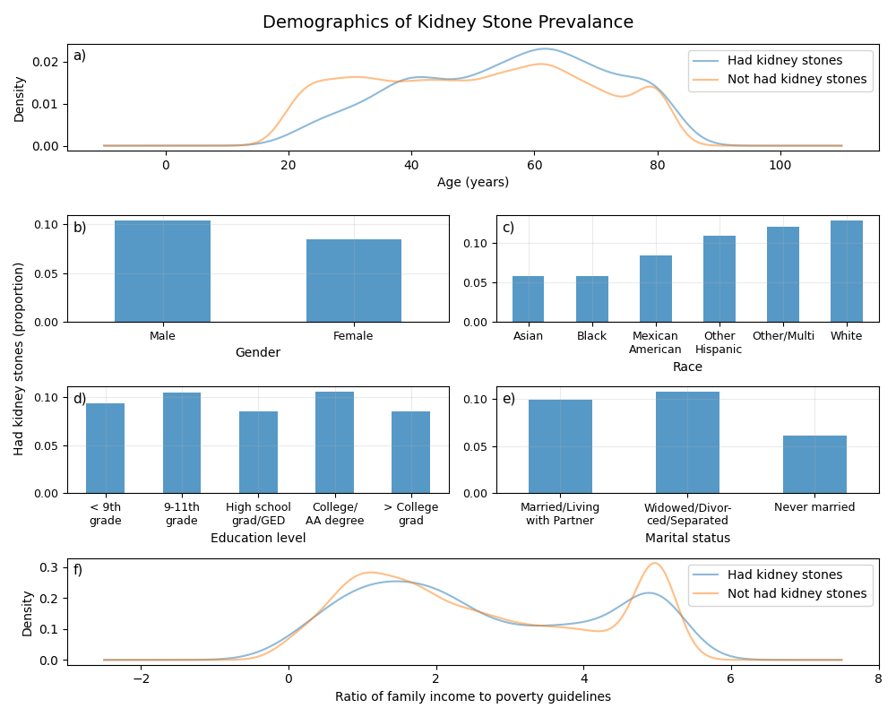
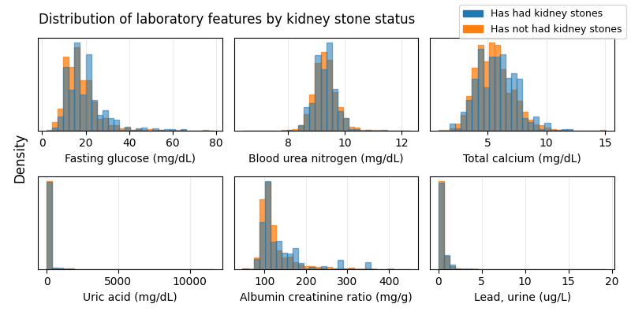
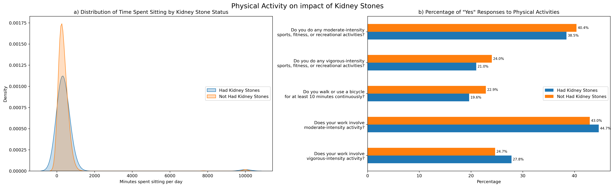

```{r setup, include=FALSE}
knitr::opts_chunk$set(echo = FALSE, message = FALSE, warning = FALSE)
library(knitr)
library(kableExtra)
```

\newpage

# 1. Background and Data

## 1.1 Background

Is kidney stone prevalence associated with factors such as diet, lifestyle, and other existing medical conditions? This project is based on the [National Health and Nutrition Examination Survey](https://www.cdc.gov/nchs/nhanes/index.htm) (NHANES) from the [National Center for Health Statistics](https://www.cdc.gov/nchs/index.htm), of the [Centers for Disease Control and Prevention](https://www.cdc.gov/). 

NHANES is an ongoing program of surveys in the United States that assesses the health and nutritional status of adults and children. The surveys collect health-related data ranging over a number of topics, which are organised broadly into Demographics, Dietary, Examination, Laboratory, and Questionnaire.

This report presents an exploratory data analysis, investigating variables previously shown to be associated with kidney stone prevalence. We evaluate the distribution, quality, and completeness of relevant data in NHANES. The aim is to explore and identify potentially suitable features for developing a machine learning model to predict kidney stone prevalence using the NHANES dataset.

Data from the most recent cycle is used, [NHANES 2017 - March 2020](https://wwwn.cdc.gov/nchs/nhanes/continuousnhanes/default.aspx?Cycle=2017-2020).

## 1.2 Data Structure and Types

```{r}
df <- read.csv("../../data/merged_data_clean.csv")
```

Data from each NHANES cycle is released as many tables, each containing a collection of similar features. For the specific focus on kidney stone disease, only a subset of tables is used, and from these tables, only a subset of key features. The integrated dataset used in this project is composed of `r nrow(df)` instances/rows, and `r ncol(df)` columns. The column `SEQN` contains a unique identifier for each instance, and the column `KIQ026` contains the target variable. Thus, there are `r ncol(df) - 2` informative features. 

The target variable belongs to the Questionnaire component of NHANES, and is phrased as "Ever had kidney stones?". Possible answers of this question are "Yes", "No", "Refused", and "Don't know". Only Yes/No are used as the binary classification label of this project (details are discussed in 1.4: Data Integration).

Counts and proportion of Yes/No of the target variable are as follows:

* Yes, has had kidney stones: 866 instances | `r signif((sum(df$KIQ026 == 1)/nrow(df)), 4)`
* No, has not had kidney stones: 8342 instances | `r signif(sum(df$KIQ026 == 2)/nrow(df), 4)`

The key features are broadly described in the following:

* Demographic: gender, age, race, education, marital status, and income. Men and older individuals are more likely to have had kidney stones, and there is evidence that kidney stone prevalence and severity is associated with various socioeconomic factors. 
* Dietary: vitamin, water, nutrient, and dietary supplement intake. Kidney stone incidence increases with certain dietary habits, such as low calcium, low potassium, and low fluid diets. Everyday foods in the NHANES dietary interviews are deconstructed and aggregated into their nutritional components, thus there is highly specific (and largely correlated) dietary and nutrient data that constitutes a significant portion of the total features explored.
* Examination: body mass index (BMI), blood pressure, and pulse readings. Indicators of general health are useful predictive features for kidney stone risk.
* Laboratory: aspects of biochemistry profile, and urine-associated tests. Detection of kidney diseases or urinary tract abnormalities (that can lead to kidney stones) are often tested by assessing levels of components such as glucose, lead, and the albumin creatinine ratio in urine.
* Questionnaire: past medical history (conditions and medicines), dietary and alcohol habits, urinary tract function, physical activity, smoking, and sleep habits. Again, general health, behaviours, and lifestyle have a large influence on kidney stone disease. Factors such as lack of physical activity and smoking can indirectly damage the urinary tract and promote stone formation.

Feature type ranges from numerical continuous to categorical binary, nominal, and ordinal. Dietary, examination, and laboratory data are mainly numerical, while demographic and questionnaire data are mainly categorical. To avoid difficult or complicated natural languange processing or text mining, free-text data was not selected.

Counts of feature types and brief examples are as follows:

* 97 numerical features, e.g: 
  * Energy in kilocalories (continuous)
  * Age in years (discrete)
* 49 categorical features e.g: 
  * Gender (binary: male, female)
  * Race (nominal: Mexican American, other Hispanic, white, etc.)
  * Diet healthiness (ordinal: excellent, very good, fair, etc.)

## 1.3 Data Completeness

```{r}
na_df <- read.csv("../figures/na_prop.csv")
```

`r sum(na_df$Proportion == 0) - 2` features have no missing values (not including the unique identifier and target variable columns). 

Features that do have missing data can be summarised as follows:

* `r sum((na_df$Proportion > 0) & (na_df$Proportion <= 0.25))` features have under 25% missing data; 
* `r sum((na_df$Proportion > 0.25) & (na_df$Proportion <= 0.50))` features have 25 - 50% missing data; 
* `r sum((na_df$Proportion > 0.5) & (na_df$Proportion <= 0.75))` features have 50 - 75% missing data; 
* `r sum((na_df$Proportion > 0.75) & (na_df$Proportion <= 1))` features have 75% - 100% missing data.

```{r}
knitr::include_graphics("../figures/na_prop.png")
```

Figure 1: a) Count of features with various missing data proportions. b) Missing data proportions of the features containing above 20% missing data. `URDFLOW1`: urine #1 flow rate; `DBD900`: # meals from fast food/pizza place; `BPXOPLS1`: pulse, 1st osocillometric reading; `BPXOPLS2`: pulse, 2nd oscillometric reading; `BPXOPLS3`: pulse, 3rd oscillometric reading; `DSDANTA`: taking antacid; `ALQ130`: average # alcoholic drinks/day; `RDXCOUNT`: # precription medicines taken; `RXDDAYS`: # days taken medicine; `DBD100`: how often add salt to food at table; `LBXGLU`: fasting glucose; `SMQ040`: smoke cigarettes; `BPQ050A`: taking prescribed medicine for HBP; `KIQ010`: how much urine lose [during urinary leakage]; `URXUPB`: lead, urine; `SMD470`: # people who smoke inside home; `DIQ070`: take diabetic pills; `DSQTKCAL`: energy (kcal);  `DIQ050`: taking insulin; `URDFLOW2`: urine #2 flow rate; `DSD128V`: [take supplement] for kidney, bladder; `DSD128FF`: [take supplement] for liver health, detoxification; `URDFLOW3`: urine #3 flow rate.

Overall, the majority of features do not have a substantial proportion of missing data (Figure 1a). Features with very large proportions of missing data should be discarded as they will likely be uninformative.

Over half of features have less than 20% missing data (Figure 1a). Features from the table "Dietary Interview - Total Nutrient Intakes" ([P_DR1TOT](https://wwwn.cdc.gov/Nchs/Nhanes/2017-2018/P_DR1TOT.htm)) are the largest contributor to this particular proportion. A large number of features were selected from that table, and data collected within pertains to a consistent subset of people. Consequently, it is reasonable to assume that features originating from the same or similar NHANES tables will share comparable patterns of missing data. For example, features related to dietary intake will only have recorded values for those who partook in dietary interviews, which may differ from the set of people who partook in laboratory tests. This pattern can also be seen in Figure 1b with the set of features `BPXOPLS1`, `BPXOPLS2`, and `BPXOPLS3`, which correspond to successive pulse readings and have identical missing value proportions (~25%).

`KIQ010`, `DSD128V`, and `DSD128FF` are features with very high percentages of missing data (over 50%), as seen in Figure 1b. They have structural missingness - e.g. in the case of `KIQ010`, recording a value for the amount of urine lost is dependent on the participant affirming that they have had urinary leakage, which most participants have not. Likewise, `DSD128V` and `DSD128FF` are both dependent on the participant affiriming that they do take supplements, which, again, may not be the case for most.

It is important to consider missing data when combining or transforming features. Creating another feature that is an average of all three pulse readings (`BPXOPLS1, BPXOPLS2, BPXOPLS3`) will not result in loss of instances, as the features have equivalent proportions of missing data (assumed to belong to the same instances). However, creating a feature that is the average of urine flow rates (`URDFLOW1, URDFLOW2, URDFLOW3`) will result in loss of instances, as all have different proportions of missing data; `URDFLOW3` has nearly 100% missing data, `URDFLOW2` has close to 90%, and `URDFLOW1` has approximately 20%. It is wiser to simply preserve the feature with the least missing data (`URDFLOW1`), instead of attempting feature combination.

## 1.4 Data Integration

Individual tables were obtained from the [NHANES](https://www.cdc.gov/nchs/nhanes/index.htm) site and joined along the unique respondent sequence number variable, `SEQN`, regardless of unmatched `SEQN`s or missing values in features (full outer join). In instances with duplicate `SEQN` but mismatching remaining values, the first instance was taken (**state why here if have time to investigate**).

All instances with missing values, recorded "Refused", or "Don't know" for the target variable were then removed from the data.

# 2. Ethics, Privacy, and Security

## 2.1 Ethical Considerations

[Discuss ethical considerations relevant to your project, such as potential biases in the data or implications of findings]

## 2.2 Privacy Concerns

[Address privacy concerns related to your project, such as handling of personal health information]

## 2.3 Security Measures

[Explain actual and potential steps to keep your project data and results secure]

# 3. Methodology

[Describe the methods used for data cleaning, preprocessing, and analysis]

# 4. Exploratory Data Analysis

## 4.1 Demographic Analysis

```{r}

```

Figure 2: a) Density distribution of age across those who have had kidney stones and those who have not. b) Proportion of males and females within their respective groups who have had kidney stones. c) Proportion of various races within their respective groups who have had kidney stones. d) Proportion of various education levels within their respective groups who have had kidney stones. The category "Refused" was removed due to extremely low count. e) Proportion of various marital statuses within their respective groups who have had kidney stones. The categories "Refused" and "Don't Know" were removed due to extremely low count. f) Density distribution of ratio of family income to poverty guidelines.

At a younger age (20 - 40 years of age), a notably higher proportion of people have never had kidney stones as opposed to have (Figure 2a). As age increases (> 50 years of age), the proportion of people who have never had kidney stones becomes less than those who have. The overall prevalence of having had kidney stones increases steadily from 20 - 40 years of age, plateaus after 40 years of age, then increases again to peak at ~60 years of age.

Figure 2b shows that approximately 10% of males have had kidney stones, while a lesser percentage of around 8% of females have. Thus, kidney stones among males are slightly higher than the overall prevalence of kidney stones (~9.4%), while females are slightly below.

There is clear fluctuation in kidney stone prevalence among different races (Figure 2c), with Asian and Black people at the lowest (just above 5% have had kidney stones), increasing to Mexican Americans (approximately 8%). Races with kidney stone prevalence greater than the overall prevalence are other Hispanic (over 10%), other/multiracial, and White people (latter two are close to 15%). There is a large distinction (~10%) between the lowest and highest prevalence. The low and high proportions are also significantly different from the overall kidney stone prevalence.

As education level changes, the proportion of those who have had kidney stones fluctuates, but there is no obvious trend among successive education levels (Figure 2d). The difference between the education level with the highest kidney stone prevalence (college/AA degree at ~10%) and lowest (high school grad/GED at ~8%) is relatively minimal.

Those that are married/living with partner or widowed/divorced/separated show a greater prevalence of kidney stones than those that have never married, as seen in Figure 2e. Never married people also have a much lower prevalence than overall kidney stone prevalance. However, this may be due to the confounding factor of age, instead of an inherent characteristic of having been married before that increases kidney stone occurance.

In Figure 2f, a ratio close to 1 means family income is approximately equal to poverty thresholds; greater than 1 means family income is above poverty thresholds. At a lower to middle ratio (0 - 4), it is slightly more common to not have had kidney stones, but not significantly. At a higher ratio (4 - 5), there is a large difference - the prevalence of never having had kidney stones is notably higher than having had them. 

Overall, Figure 2 indicates that nearly all demographic features - age, gender, marital status, race, and ratio of family income to poverty guidelines - are associated with prevalence of kidney stones. Confirming previous research, older people and males are more likely to have had kidney stones. Age may be a confounding factor in the apparent association of kidney stone occurance with marital status, but regardless it can still be a useful feature. The lack of significant association between education level and kidney stones indicate that it might be uninformative in a predictive context.

## 4.2 Health Conditions Analysis

```{r}
knitr::include_graphics("../figures/cond_ks_prop.png")
```

Figure 3: The proportion of people with various other conditions who also have had kidney stones.

Gallstones and weak/failing kidneys are the most strongly associated with kidney stone occurance, with close to 25% of people having (either or both of) those conditions also having had kidney stones. Between ~11% and ~15% of people who have the remaining conditions also have had kidney stones. All these are much higher than overall kidney stone prevalence (9.4%), indicating that these features are likely to be useful for a predictive model. It can be noted that some of these conditions may also possess a high degree of correlation between each other, which may be reflected in their similar proportions in Figure 3, e.g. being overweight and having high cholesterol. Feature combination/transformation could be used to reduce dimensionality.

## 4.3 Laboratory Analysis

```{r}

```

Figure 4: Density distributions of laboratory features, split by those who have had kidney stones and have not had kidney stones. a) Fasting glucose. b) Blood urea nitrogen. c) Total calcium. d) Uric acid. e) Albumin creatinine ratio. f) Lead in urine.

Figure 4 shows that most laboratory features appear within expected ranges, with the exception of uric acid (Figure 4d). There appears to be outlier(s) skewing this feature with up to 10000 mg/dL uric acid, which is likely to be an error as ordinary uric acid levels should not exceed the single-digit mg/dL range. 

Distribution shape of laboratory features remains relatively identical, regardless of kidney stone status. Distributions for fasting glucose (Figure 4a) and total calcium (Figure 4c) are shifted slightly right (towards higher values) for those who have had kidney stones. The peak bin for blood urea nitrogen (Figure 4b) is at a marginally lower value for those who have had kidney stones in comparison to those who have not. Albumin creatinine ratio appears to peak later, and remain slightly higher, at increasing mg/g for those who have had kidney stones (Figure 4e). Distributions for lead (Figure 4f) and uric acid are consistent for both kidney stone statuses - however, detail in the uric acid histogram may be obscured by the outlier(s). 

Figure 4 indicates that uric acid and lead are not associated with kidney stone prevalence. The remaining laboratory features are associated due to differing distributions according to kidney stone status.

## 4.4 Dietary Analysis

```{r}
knitr::include_graphics("../figures/dietary_difference.png")
```

Figure 5: Dietary Differences

Alcohol consumption shows the largest negative difference (-25.2%), indicating that individuals who have had kidney stones tend to consume significantly less alcohol. This could suggest that those with a history of kidney stones may have modified their diet to reduce alcohol intake. 

In addition, Alpha-carotene and beta-carotene (both forms of vitamin A) display substantial negative differences (-24.0% and -13.8% respectively), with those who have had kidney stones consuming less. This unexpected finding warrants further investigation into the potential protective effects of carotenoids or differences in vitamin A metabolism among those with a history of kidney stones.

In contrast, Retinol (another form of vitamin A) shows a positive difference (+11.5%), with individuals who have had kidney stones consuming more. This contrasts with the carotenoid findings and suggests a complex relationship between different forms of vitamin A and kidney stone history.

Interestingly, caffeine and theobromine show the largest positive differences (+14.4% and +13.9%), suggesting higher intake in those with a history of kidney stones. This could reflect dietary changes after diagnosis.

Lycopene intake is 10.1% higher in those with a history of kidney stones, which is interesting given its antioxidant properties.

Vitamin C intake is 8.4% lower in individuals who have had kidney stones, which might be relevant to stone formation or dietary patterns associated with kidney stone risk.

Lycopene intake is 10.1% higher in those with a history of kidney stones, which is interesting given its antioxidant properties.

Among the top factors, we see a trend in vitamins and antioxidants, particularly forms of vitamin A, vitamin C, and vitamin E (alpha-tocopherol). This pattern suggests that the balance and forms of certain vitamins may be different in individuals with a history of kidney stones.

## 4.5 Physical Activity Analysis

```{r}

```

Figure 6: Association between Kidney Stone History, Sedentary Behavior, and Physical Activity Patterns

Figure 6a shows similar sitting time distributions between those with and without kidney stone history. Interestingly, it contrasts with the earlier findings by Li et al. (2024) from 2007-2016 data, which suggested an increasing trend in kidney stone prevalence with increased sitting time among less active individuals. 

This difference could indicate a shift in the relationship between sedentary behavior and kidney stones over time, or reflect changes in lifestyle patterns in the past few years. 

In addition, we have also observed a small secondary peak at around 10,000 minutes (~167 hours) of sitting time and negative minutes spend sitting in both groups. This likely represents outliers or data entry errors.

Sedentary behavior and physical activity patterns in relation to kidney stone history have been subjects of ongoing research, with findings evolving over time. 

Examining physical activity patterns, we observe slight differences in recreational activities between those with and without kidney stone history. For moderate-intensity sports, fitness, or recreational activities (38.5% vs. 40.4%), vigorous-intensity activities (21.0% vs. 24.0%), and walking or cycling for at least 10 minutes continuously (19.6% vs. 22.9%), individuals without kidney stone history report marginally higher participation rates. While these differences are small, they align with findings from Sorensen et al. (2014), who reported that higher levels of physical activity were associated with lower risk of kidney stones.

Interestingly, for work-related physical activities, we see a reverse trend. Those with kidney stone history report slightly higher rates of work-related moderate-intensity activity (44.7% vs. 43.0%) and work-related vigorous-intensity activity (27.8% vs. 24.7%). This distinction between recreational and occupational physical activity in relation to kidney stone history is intriguing and warrants further investigation. It may suggest that the context and nature of physical activity, not just the intensity, could play a role in kidney stone risk.

# 5. Discussion

[Summarize key findings and their implications]
[Discuss limitations of the study]
[Suggest areas for future research]

# 6. Conclusion

[Provide a concise summary of the main findings and their significance]

# 7. Individual Contributions

[State the contributions of each group member to data preparation, analysis, and report writing]

# 8. References

[List references using a consistent citation style]